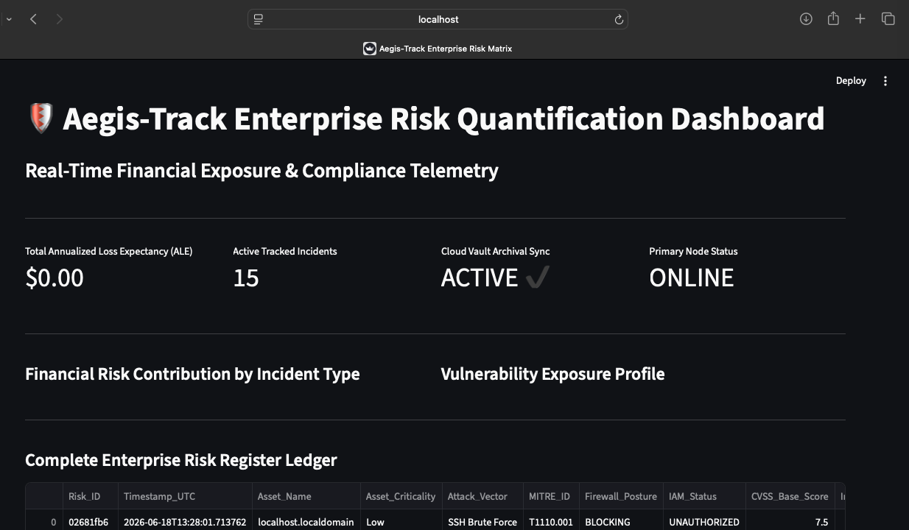
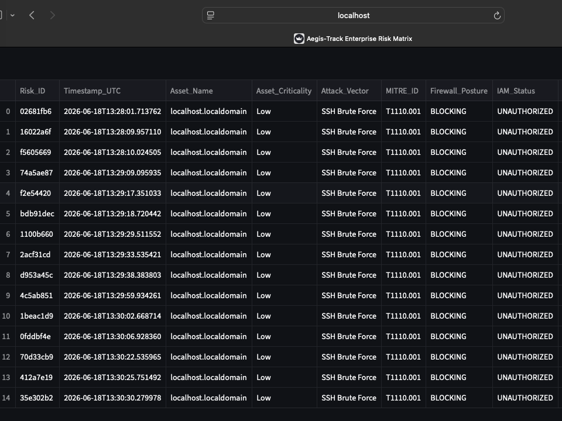
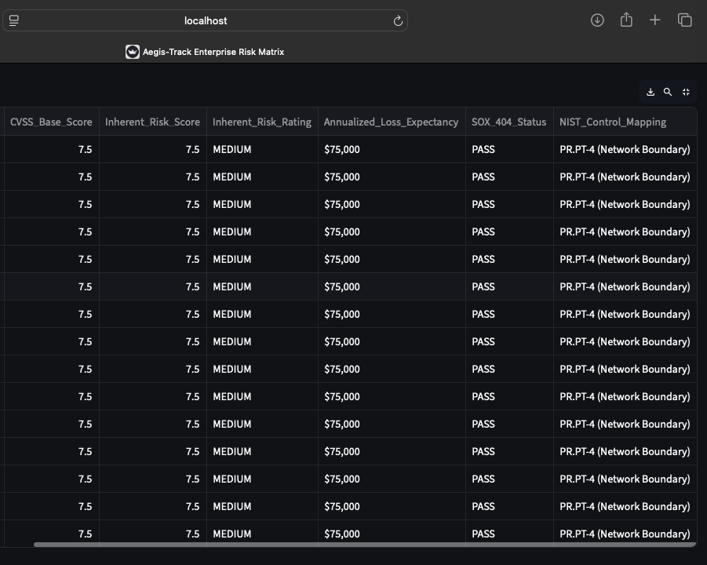
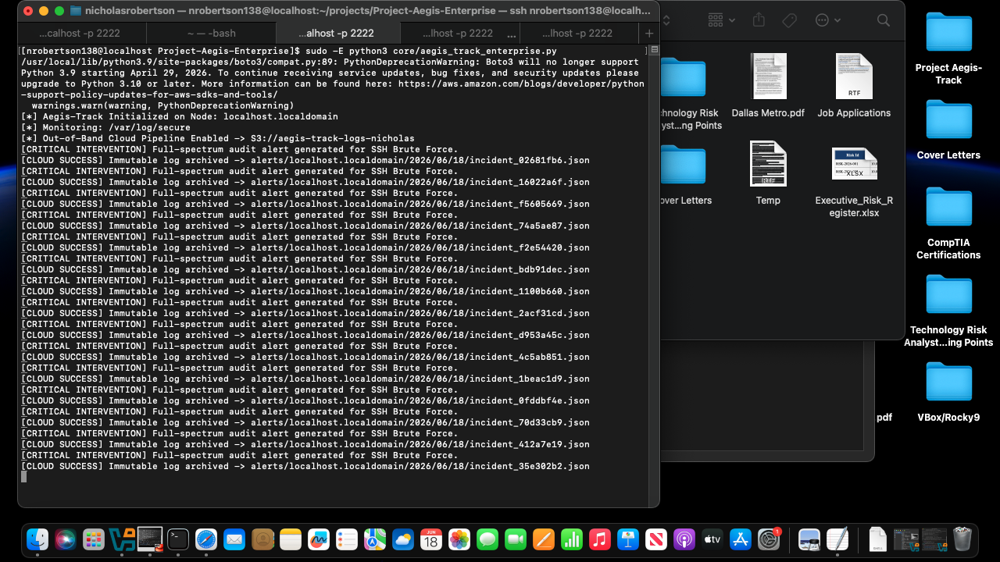
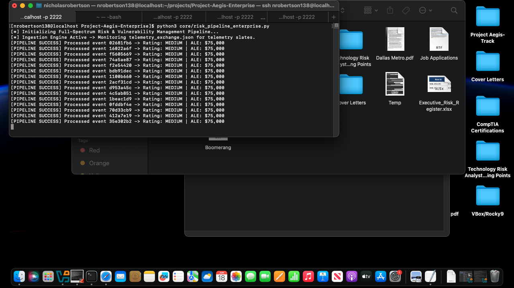
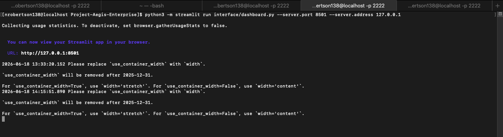
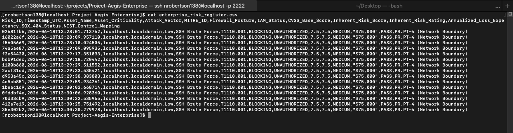

# Aegis-Enterprise Threat Telemetry & Risk Quantification Pipeline

The Aegis Enterprise Pipeline is a security tool that watches for server threats and turns technical data into financial numbers that businesses can understand. 

It monitors a Linux system in real time, backs up critical security alerts to a secure Amazon Web Services (AWS) cloud storage bucket, and automatically calculates the potential dollar loss from an attack. Finally, it displays all this data on an interactive visual dashboard.

---

## 🏗️ How the System Works

The project is split into three main parts that work together smoothly:

1. **The Monitor (Log Ingestion):** A background program constantly watches the system's security logs (`/var/log/secure`). It looks for patterns like someone trying to guess a password over and over (an SSH Brute Force attack).
2. **The Cloud Vault (AWS Backup):** As soon as an attack is found, the system packages the details into a clean JSON file and sends it to an immutable AWS S3 bucket. This means an attacker cannot delete or alter the logs to hide their tracks.
3. **The Risk Engine & Dashboard:** The system takes the technical threat data and estimates how much money the business could lose using standard risk assessment frameworks. A web-based dashboard then shows these numbers in clean tables and graphs.

---

## 📂 Repository Structure

* **`core/aegis_track_enterprise.py`**: The real-time log monitor that catches threats and streams them securely to AWS.
* **`core/risk_pipeline.py`**: The calculation engine that rates risks and maps them to standard security guidelines (like NIST SP 800-53).
* **`interface/dashboard.py`**: The code that generates the interactive web interface and charts.
* **`requirements.txt`**: The list of software packages needed to run this project.

---

## 🧮 Understanding the Risk Calculations

To help managers understand how serious a threat is, the system calculates an **Inherent Risk Score** and an **Annualized Loss Expectancy (ALE)** using a clear formula:

* **The Basic Formula:** $$\text{Risk Score} = \text{Threat Severity (CVSS)} \times \text{Asset Importance Weight}$$
* **The Extra Safety Check:** If the system notices that a server's firewall defense is failing or "Degraded," it automatically adds a **15% risk penalty** because the system is now more vulnerable.
* **The Dollar Value (ALE):** The final risk score is multiplied by \$10,000 to give an estimate of what that specific type of attack could cost a business over the course of a year.

---

## 🖥️ System Preview

### 1. Real-Time Risk Quantification Dashboard

### 2. Enterprise Risk Matrix (Overview)

### 3. Enterprise Risk Matrix (Detailed)

### 4. Core Agent Daemon (`aegis_track_enterprise.py`)

### 5. Risk Quantification Pipeline Engine (`risk_pipeline_enterprise.py`)

### 6. User Interface Architecture (`dashboard.py`)

### 7. Flattened Enterprise Risk Register Log Ledger

**Developer:** Nicholas Robertson  
**Certifications:** CompTIA CySA+ | CompTIA Linux+ | CompTIA Security+ | CompTIA Network+ | CompTIA A+  

### 🗺️ Framework Mappings & Regulatory Alignment
This pipeline architecture programmatically integrates and aligns with the following industry-standard cybersecurity frameworks and regulatory requirements:

* **Risk Assessment & Management:**
    * **NIST SP 800-30:** Utilized to govern the pipeline's quantitative risk assessment methodologies and threat identification processes.
    * **NIST Cybersecurity Framework (CSF):** Mapped directly to core functions—specifically **PR.PT (Protect: Protective Technology)** and **PR.AC (Protect: Identity Management and Access Control)**.
* **Security Controls & Operational Standards:**
    * **NIST SP 800-53 Rev. 5:** Programmatically flags and audits specific security controls, such as **AC-7 (Unsuccessful Logon Attempts)** and **AU-6 (Audit Record Review, Analysis, and Reporting)**.
    * **ISO/IEC 27001:** Aligned with international information security management standards, specifically targeting **Annex A Controls** for logging, monitoring, and access restriction.
* **Regulatory Compliance:**
    * **Sarbanes-Oxley Act (SOX) Section 404:** Integrates continuous control monitoring (CCM) to audit financial data integrity and ensure the reliability of automated internal security controls.
* **Threat Modeling & Tactical Defense:**
    * **MITRE ATT&CK® Matrix:** Maps real-time telemetry alerts directly to standardized adversary tactics and techniques, specifically identifying **T1110 (Brute Force)** and **T1548 (Abuse of Elevation Control Mechanism)**
